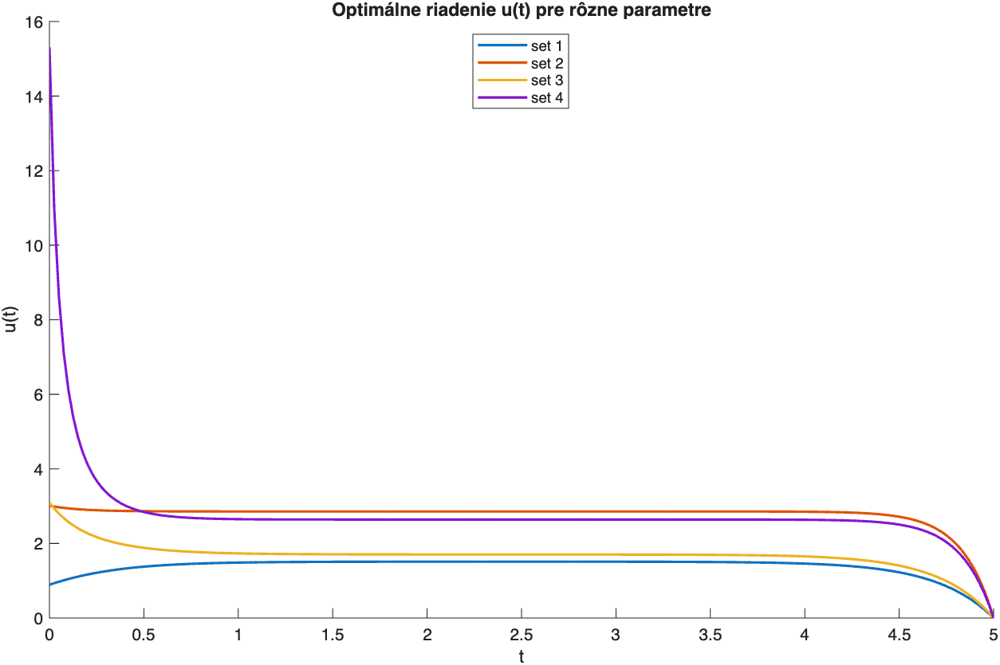
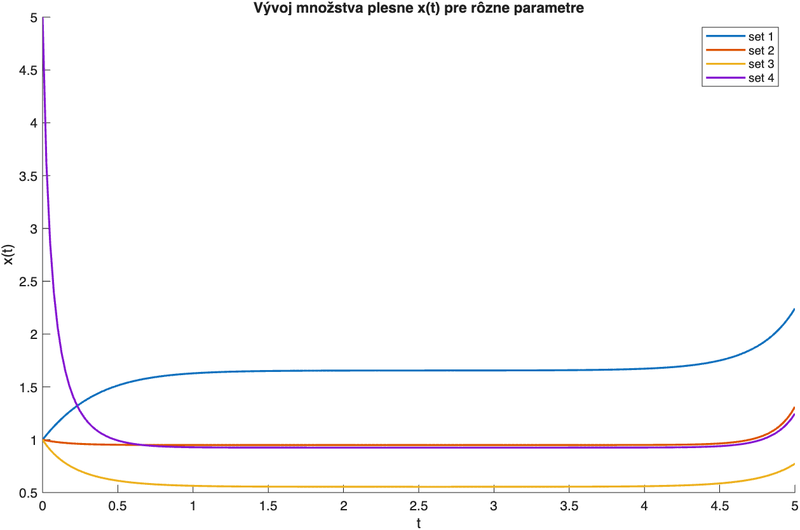

# Optimal Control of Mold Growth (MATLAB)

This repository contains a small optimal control case study solved using **Pontryagin’s Maximum Principle** and MATLAB’s **bvp4c** boundary value problem solver.

## Problem
We model the amount of mold \(x(t)\) and control it via an intensity \(u(t)\) (e.g., cleaning/chemical treatment):

\[
x'(t) = r(M - x) - u(t)x, \quad x(0)=x_0
\]

We minimize the trade-off between mold amount and control effort:

\[
J(u) = \int_0^T \left(Ax(t)^2 + u(t)^2\right)\,dt
\]

## Method
Applying Pontryagin’s principle yields the optimal control:
\[
u^*(t) = \frac{1}{2}p(t)x(t)
\]
where \(p(t)\) is the adjoint variable with terminal condition \(p(T)=0\).

The resulting two-point boundary value problem is solved numerically using `bvp4c`.

## Results
The repository compares **4 parameter sets** and visualizes:
- optimal control \(u(t)\)
- state trajectory \(x(t)\)

## How to run
1. Open MATLAB
2. Run:
   - `src/main.m`

## Files
- `src/` – MATLAB implementation (BVP formulation + solver)
- `figures/` – exported plots
- `report/optimal_control_mold_report.pdf` – short report with model description and derivation
